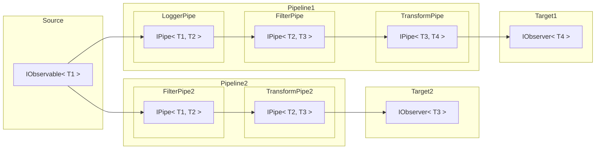

# ObservablePipelines

A simple .NET package to achieve a clean pipeline architecture with Observables.

## Introduction

This package contains a few simple interfaces and logic, that allows you to configure and build Pipelines extremely clean, fast and dynamic with `IObservable`'s. The only reference needed is "Microsoft.Extensions.DependencyInjection", as the PipelineBuilder uses this internally to dynamically construct the Pipelines.



In the diagram above, you can see the principle of a pipeline. You have a single source, which emits values. These values will be sent through one or more pipelines, where they may be filtered, used for side-logic, or transformed.

Observables are very well suited for this job, as they are already extremly well usable with the package `System.Reactive.Linq`. When using Observables with this package, you are able to handle streams of events with a LINQ like query. They also enable you to filter the event streams. This would not be possible with using `T` instead of `IObservable<T>`, as you would need to return `null` inside a pipe or anything like that.

## Usage

### 1. Install the package:

```console
Install-Package ObservablePipelines
or
dotnet add package ObservablePipelines
```

### 2. (Optional, but recommended) Install `System.Reactive.Linq`:

```console
Install-Package System.Reactive.Linq
or
dotnet add package System.Reactive.Linq
```

### 3. Add Dependencies to DI-Container

```csharp
using Microsoft.Extensions.DependencyInjection;

services.AddObservablePipelines()
```

### 4. Inject and use `IPipelineBuilder`

```csharp
var pipeline = pipelineBuilder
    .Configure(builder => builder
        .Add(new MessageFilterPipeOptions(Guid.Empty))
    )
    .Construct(builder => builder
        .AddSource(chatMessages)
        .AddStep<LoggerPipe, ChatMessage>()
        .AddStep<MessageFilterPipe, ChatMessage>()
        .AddStep<MessageTransformPipe, IdentifiedChatMessage>()
    )
    .Build();

pipeline.Subscribe(m =>
    logger.LogInformation($"New Message from {m.SenderName}: {m.Message}.")
);
```

## Configuration

As the PipelineBuilder uses Dependency-Injection, you can add Configuration-Objects to the builders ServiceCollection, by calling `Configure()`. The type, that you add to the ConfigurationBuilder should be unique, so that it can be injected into the correct pipe.

```csharp
internal record MessageFilterPipeOptions(Guid ReceiverId);

internal class MessageFilterPipe : IPipe<ChatMessage, ChatMessage>
{
    private readonly MessageFilterPipeOptions options;

    public MessageFilterPipe(MessageFilterPipeOptions options) {
        this.options = options;
    }
}

pipelineBuilder
    .Configure(builder => builder
        .Add(new MessageFilterPipeOptions(Guid.Empty))
    );
```
