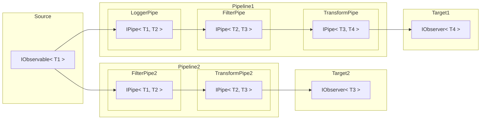

# ObservablePipelines

[](https://www.nuget.org/packages/ObservablePipelines)
[](https://www.nuget.org/packages/ObservablePipelines)

A simple .NET package to achieve a clean pipeline architecture with Observables and injectable pipes.

### Installing ObservablePipelines

You should install [ObservablePipelines with NuGet](https://www.nuget.org/packages/ObservablePipelines):

    Install-Package ObservablePipelines

Or via the .NET Core command line interface:

    dotnet add package ObservablePipelines

Either commands, from Package Manager Console or .NET Core CLI, will download and install ObservablePipelines.
ObservablePipelines is compatible with .NET 4.6.1+, NET Standard, NET Core and all .NET versions above.

## When to use

This package is useful in scenarios, where you want to explicitly state what happens step by step. A Pipe would represent the perfect `Single Responsibility Object`, as it will only handle one explicit case, e.g. filtering, or transforming.

Additionally you can construct Pipelines with Dependency Injection, and thus save a lot of construction code and unnecessary dependencies.

## Introduction

This package contains a few simple interfaces and logic, that allows you to configure and build Pipelines extremely clean, fast and dynamic with Dependency Injection and `IObservable`'s. The only reference needed is "Microsoft.Extensions.DependencyInjection", as the PipelineBuilder uses this internally to dynamically construct the Pipelines.



In the diagram above, you can see the principle of a pipeline. You have a single source, which emits values. These values will be sent through one or more pipelines, where they may be filtered, used for side-logic, or transformed.

Observables are very well suited for this job, as they are already extremly well usable with the package `System.Reactive.Linq`. When using Observables with this package, you are able to handle streams of events with a LINQ like query. They also enable you to filter the event streams. This would not be possible with using `T` instead of `IObservable<T>`, as you would need to return `null` inside a pipe or anything like that.

If you have not yet worked with Observables, I highly recommend checking out this tutorial:

[Introduction to Rx](http://introtorx.com/)

## Usage

### 1. Install the package:

```console
Install-Package ObservablePipelines
or
dotnet add package ObservablePipelines
```

### 2. (Optional, but recommended) Install `System.Reactive.Linq`:

```console
Install-Package System.Reactive.Linq
or
dotnet add package System.Reactive.Linq
```

### 3. Add Dependencies to DI-Container

```csharp
using Microsoft.Extensions.DependencyInjection;

services.AddObservablePipelines()
```

### 4. Implement `IPipe<TIn, TOut>`

```csharp
internal class LoggerPipe : IPipe<ChatMessage, ChatMessage>
{
    private readonly ILogger<LoggerPipe> logger;

    public LoggerPipe(ILogger<LoggerPipe> logger) {
        this.logger = logger
            ?? throw new ArgumentNullException(nameof(logger));
    }

    public IObservable<ChatMessage> Handle(IObservable<ChatMessage> source) {
        return source
            .Do(m =>
                logger.LogInformation($"Pipeline triggered for message: '{m.Message}'.")
            );
    }
}
```

Inside the Pipe, I recommend you to use `System.Reactive.Linq` to handle the event streams. In the constructor you can add all dependencies, that you set up the DI-Container with.

### 6. Inject and use `IPipelineBuilder`

```csharp
var pipeline = pipelineBuilder
    .ConfigureOptions(builder => builder
        .Add(new MessageFilterPipeOptions(Guid.Empty))
    )
    .ConfigurePipeline(builder => builder
        .AddSource(chatMessages)
        .AddStep<LoggerPipe, ChatMessage>()
        .AddStep<MessageFilterPipe, ChatMessage>()
        .AddStep<MessageTransformPipe, IdentifiedChatMessage>()
        .AddStep(new ConsoleLoggerPipe())
    )
    .Build();

pipeline.Subscribe(m =>
    logger.LogInformation($"New Message from {m.SenderName}: {m.Message}.")
);
```

Here you can add Options-Instances, that were not added to the global DI-Container. The PipelineBuilder clones the global DI-Container and adds all Options-Instances to it. With them you are able to explitly configure your Pipes for certain usecases and you can use the same Pipe with different configurations.

First, you need to add the source of the Pipeline with `AddSource()`.
After that, you can add your `IPipe`s as generics, where you also have to specify the type of the output. This way it will be built, using Dependency Injection.

Alternatively, you can add an instance and do not need to specify generic type arguments.

## Configuration

As the PipelineBuilder uses Dependency-Injection, you can add Options-Instances to the builders ServiceCollection, by calling `Configure()`. The type, that you add to the ConfigurationBuilder should be unique, so that it can be injected into the correct pipe.

```csharp
internal record MessageFilterPipeOptions(Guid ReceiverId);

internal class MessageFilterPipe : IPipe<ChatMessage, ChatMessage>
{
    private readonly MessageFilterPipeOptions options;

    public MessageFilterPipe(MessageFilterPipeOptions options) {
        this.options = options;
    }
}

pipelineBuilder
    .Configure(builder => builder
        .Add(new MessageFilterPipeOptions(Guid.Empty))
    );
```

## Types to use

- `IPipe<TIn,TOut>`: Pipe Interface with ingoing and outgoing IObservable Stream
- `IPipelineBuilder`: Builder, to set up a Pipeline with Configurations, a Source and multiple Pipes.

## Warning about Singleton Injection

If you are injecting a singleton service, make sure to build the singleton service prior to building a pipeline. As the PipelineBuilder is manipulating the IServiceCollection AFTER the main IServiceProvider has been built, the original IServiceProvider will not get the same singleton instance as the pipeline.
